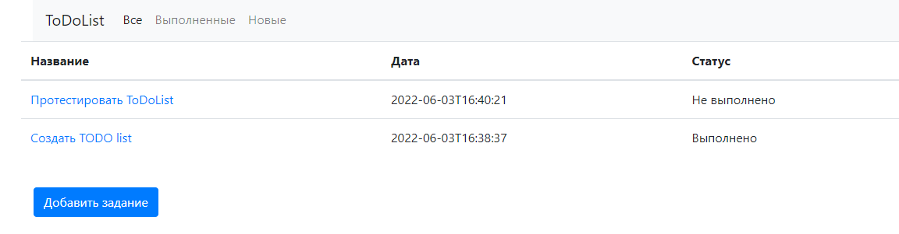
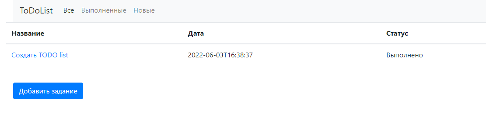
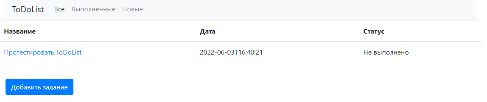
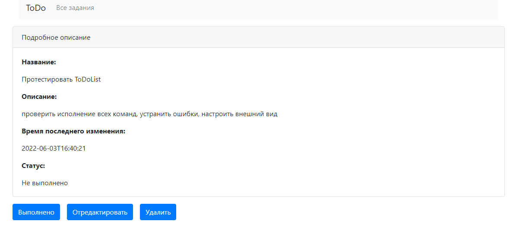
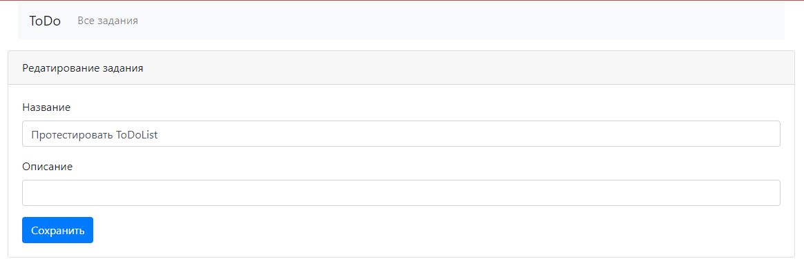

# job4j

О проекте: знакомство с hibernate

Стек технологий:
Spring boot, Thymeleaf, Bootstrap, Hibernate, PostgreSql

Сборка или установка:
собирается через Maven

Как использовать: пока просто смотреть)

Контакты:https:
//github.com/zweidmitr

Описание:

- Страница со списком всех заданий. В таблице отображаем имя, дату создания и состояние (выполнено или нет)
    - На странице со списком три ссылки: Все, Выполненные, Новые.
      
      - При перевода по ссылкам в таблице отображаются: все задания, только выполненные или только новые.
      
      

- При клике на задание переходим на страницу с подробным описанием.
    - На странице с подробным описанием кнопки: Выполнено, Отредактировать, Удалить.
      
    - Если нажали на кнокпу выполнить, то задание переводиться в состояние выполнено.
    - Кнопка Отредактировать переводит пользователя на отдельную страницу для редактирования.
      

    - Кнопка удалить, удаляет задание и переходит на список всех заданий.
