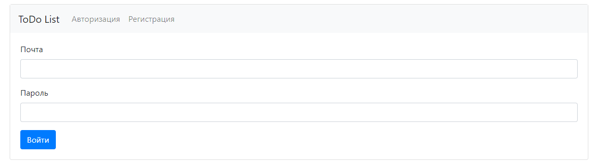
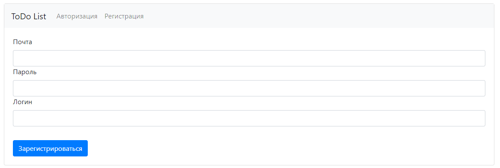
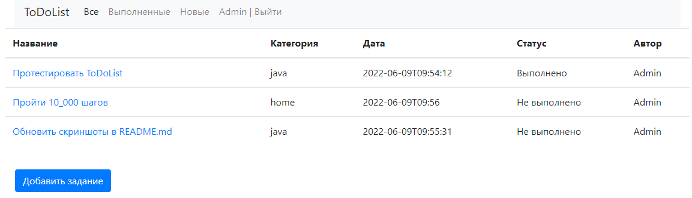
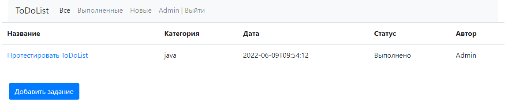
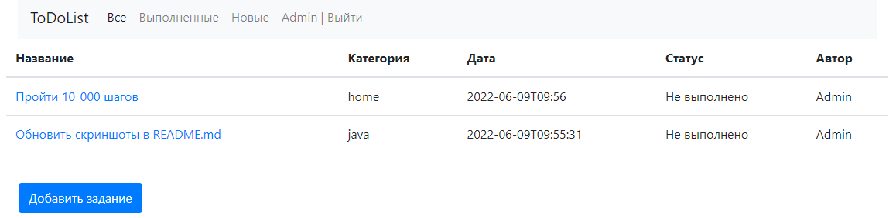
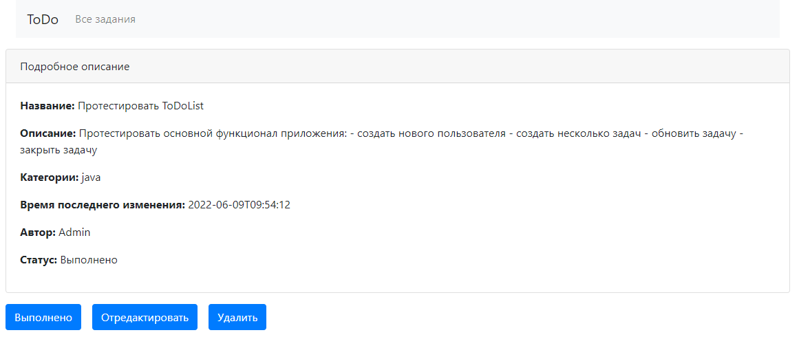
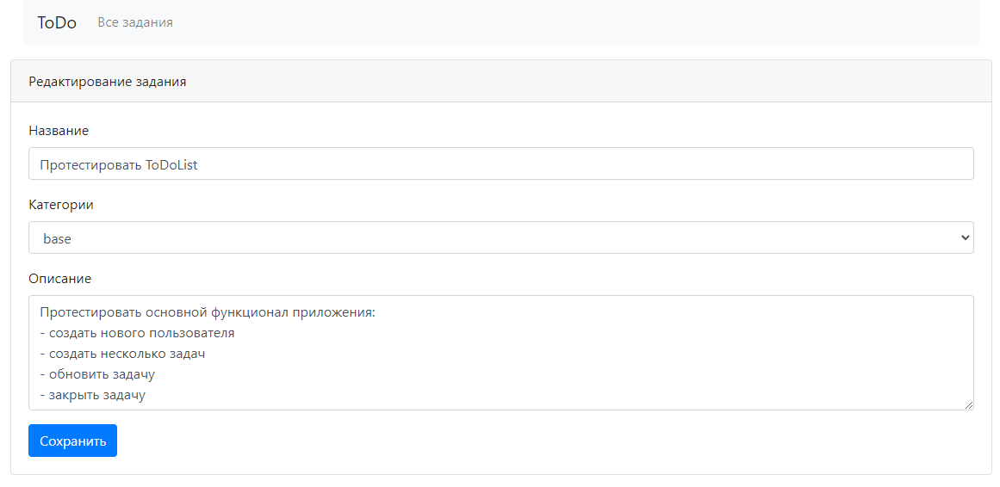

# job4j_ToDoList

О проекте: Закрепление материала по разделу hibernate, создание приложения с использованием полученных знаний

Стек технологий:
Spring boot, Hibernate, PostgreSql

Сборка или установка:
собирается через Maven

Как использовать: можно скачать, можно смотреть, но однажды... :)

Контакты: https://github.com/zweidmitr

Описание:
- Приложение выполнено для оптимизации времени, фиксирование и отслеживание задач.
  - При первом входе, пользователь видит страницу авторизации / регистрации
  
  
  - После успешного прохождения первого шага открывается страница со списком всех задач.
- На странице есть три основные ссылки: Все, Выполненные, Новые.
  При переходе по ним отображаются: все задания, только выполненные или новые.
  
  
  

   - При клике на задачу переходим на страницу с подробным описанием.
   - На странице с подробным описанием кнопки: Выполнено, Отредактировать, Удалить.
   
     - Кнопка Выполнить, переводит задачу в состояние выполнено.
     - Кнопка Отредактировать открывает пользователю  страницу для редактирования.
     
     - Кнопка Удалить, стирает задачу и переходит на список всех заданий.