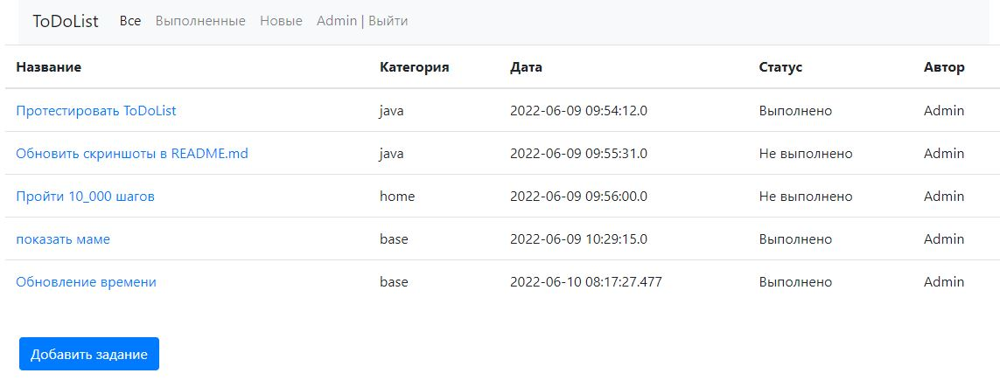
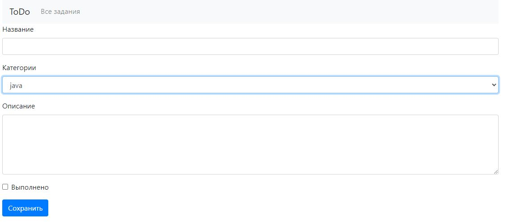

# Проект "To DO" лист

* [Описание](#описание)
* [Функционал](#функционал)
* [Технологии](#технологии)
* [Архитектура](#архитектура)
* [Интерфейс](#интерфейс)
* [Автор](#автор)

## Описание
MVC - приложение, для оптимизации времени, фиксирование и отслеживание задач. 
todo-список дел. на Spring Boot.
Для хранения данных применяется Hibernate. Данные на главную страницу
(где располагается сам список действий и интерфейс работы с ним)

## Функционал
* Регистрация пользователя
* Авторизация через БД PostgreSQL
* Добавление задачи в TODO-list
* Пометить задачу как выполненную
* Вывод всех задач
* Вывод только незавершённых задач

## Технологии
* Spring boot
* Hibernate
* Java16
* PostgreSQL
* HTML, BOOTSTRAP
* Junit

## Архитектура
Проект реализован по шаблону MVC и разделён на слои:
1. Модели данных(Model)

1.1 [Item](src/main/java/ru/job4j/todo/model/Item.java) -
Модель для хранения данных задачи

1.2 [Category](src/main/java/ru/job4j/todo/model/Category.java) - 
Модель для хранения данных по задаче

1.3 [User](src/main/java/ru/job4j/todo/model/User.java) -
Модель для хранения данных пользователя

2. Хранилища(Persistence)

2.1 [DBStoreSession](src/main/java/ru/job4j/todo/persistence/DBStoreSession.java) -
Интерфейс для работы с сессией Hibernate (открытие/транзакция/закрытие)

2.2 [ItemDBStore](src/main/java/ru/job4j/todo/persistence/ItemDBStore.java) -
CRUD класс по работе с задачами

2.3 [CategoryDBStore](src/main/java/ru/job4j/todo/persistence/CategoryDBStore.java) -
CRUD класс по работе с категориями

2.4 [UserDBStore](src/main/java/ru/job4j/todo/persistence/UserDBStore.java) -
CRUD класс по работе с пользователями

3. Контроллеры(Controller)

3.1 [UserController](src/main/java/ru/job4j/todo/control/UserController.java) -
Контроллер по работе с пользователями, осуществляет регистрацию пользователя,
проверяет существует ли в PostgreSQL хранилище такой пользователь. В случае успешной авторизации, добавляет
пользователя в Http-сессию.

3.2 [ItemController](src/main/java/ru/job4j/todo/control/ItemController.java) -
Контроллер по работе с задачами

4. Фильтр(filter)
4.1 [AuthFilter](src/main/java/ru/job4j/todo/filter/AuthFilter.java) -
Блокирует доступ неавторизованному пользователю ко всем страницами приложения,
кроме страниц авторизации и регистрации.

## Интерфейс

* Интерфейс приложения

* Регистрируемся

* Авторизируемся

* Добавляем новую задачу

* Просматриваем задачу

* Редактируем задачу

## Автор

Дмитрий

Java-разработчик

zweidmitr@gmail.com